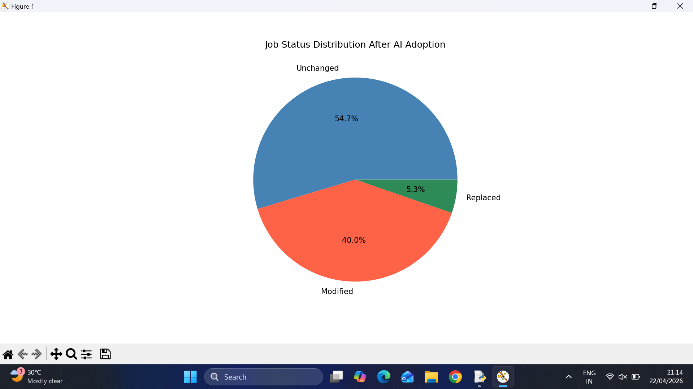
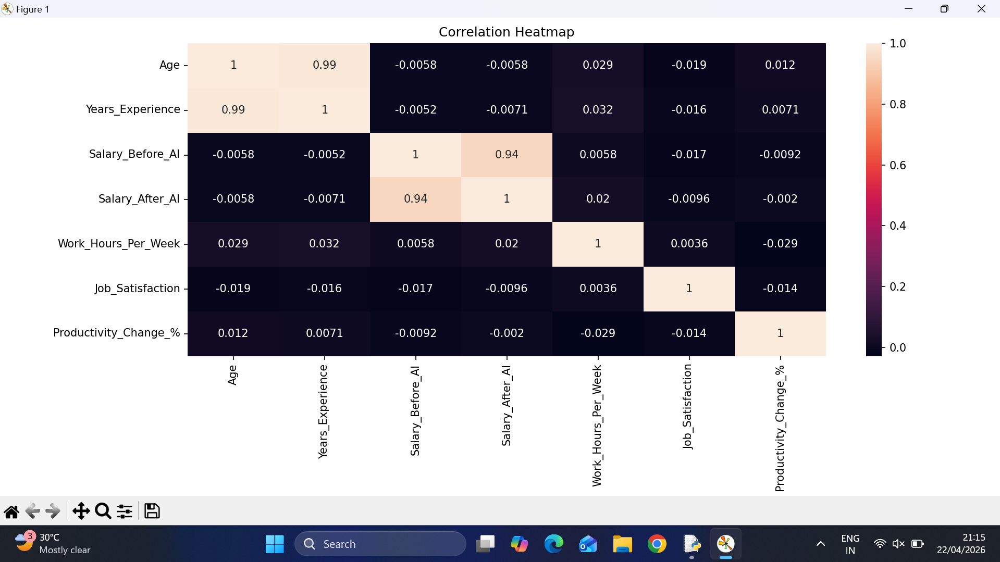
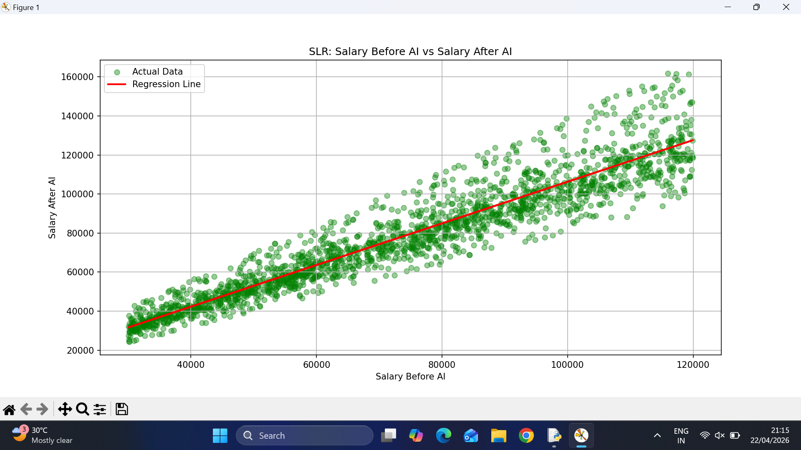
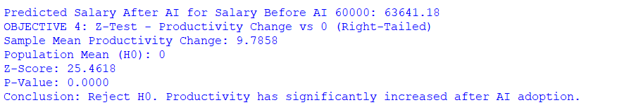
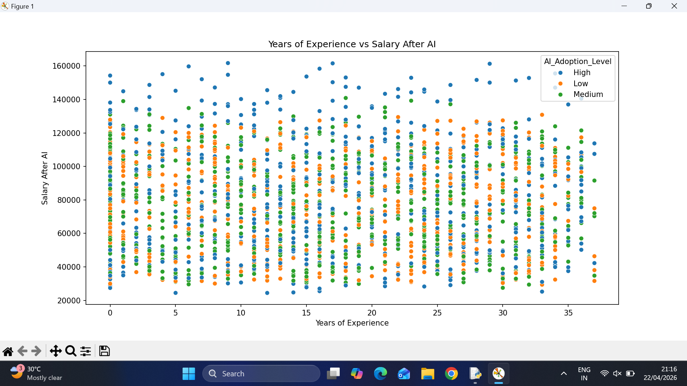

# AI Job Impact Analysis
**Course:** INT375  
**Dataset:** AI Job Impact Dataset (2000 records, 17 columns)  
**Data Source:** [Kaggle - AI Job Impact Dataset](https://www.kaggle.com/)

## Objectives
1. Job Status Distribution after AI Adoption (Pie Chart)
2. Correlation Heatmap of numeric attributes
3. Simple Linear Regression – Salary Before AI vs Salary After AI
4. Z-Test – Productivity Change significantly greater than 0
5. Years of Experience vs Salary After AI (Scatter Plot)

## Libraries Used
- pandas, numpy, matplotlib, seaborn, scipy, sklearn

## How to Run
```bash
pip install pandas numpy matplotlib seaborn scipy scikit-learn
python AI_Job_Impact_Project.py
```

## Key Findings
- 54.7% of jobs remained Unchanged, 40% Modified, 5.3% Replaced
- Salary Before AI strongly predicts Salary After AI (R² = 0.88)
- Z-Test confirms productivity significantly increased after AI adoption
- High AI Adoption Level shows highest salaries across all genders

## Results / Output Screenshots

### Objective 1 - Job Status Distribution (Pie Chart)


### Objective 2 - Correlation Heatmap


### Objective 3 - Linear Regression: Salary Before vs After AI


### Objective 4 - Z-Test Output


### Objective 5 - Years of Experience vs Salary After AI

